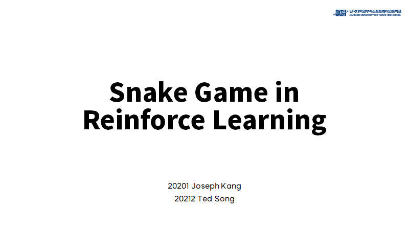

# Snake Game AI using DQN

<div align="center">

[](http://www.youtube.com/watch?v=a2BI2aOCGrs "Snake Game in DQN")

[< Plese click this video >](http://www.youtube.com/watch?v=a2BI2aOCGrs)

</div>

## Model Architecture

```Python
# Model Architecture

Sequential(
    (0): Linear(in_features=85, out_features=256)
    (1): ReLU(inplace)
    (2): Linear(in_features=256, out_features=128)
    (3): ReLU(inplace)
    (4): Linear(in_features=128, out_features=64)
    (5): ReLU(inplace)
    (6): Linear(in_features=64, out_features=3)
)
```

---

<div align="center">

[](./main.pdf "Download File")

[< Please click to download PDF >](./main.pdf)

</div>